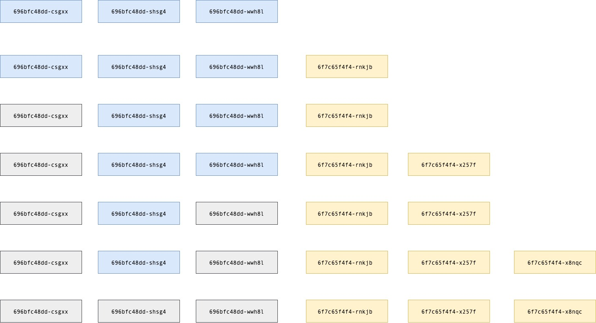

## Deployment, Replicaset
- Replicaset
  - Podの親
  - 任意のPodを複製しそれらを束ねる
- Deployment
  - Replicasetの親
  - Replicasetを束ねる
```bash
Deployment
└── ReplicaSet # v1
    ├── Pod
    ├── Pod
    └── Pod
└── ReplicaSet # v2
    ├── Pod
    ├── Pod
    └── Pod
```
- Deploymentを利用するメリット
  - RollingUpdateによる無停止デプロイが可能になる。
  - 上図のように1個目のReplicasetにv1、2つ目のReplicasetにv2モジュールを立ち上げるようにできる
- maxUnavailable, maxSurge
  - どちらも％で指定する
  - maxUnavailable
    - デプロイ中に最大何%のPodが失われてもいいか
  - maxSurge
    - デプロイ中に最大何%のPodが増えてもいいか

## 実践
Replicasetの作成
```bash
$ kubectl apply -f chapter-06/replicaset.yaml 
replicaset.apps/httpserver created
$ kubectl get pod                
NAME               READY   STATUS    RESTARTS   AGE
httpserver-297sj   1/1     Running   0          40s
httpserver-dsxgj   1/1     Running   0          40s
httpserver-vsvcq   1/1     Running   0          40s
```

Replicasetの直接確認
```bash
$ kubectl get replicaset      
NAME         DESIRED   CURRENT   READY   AGE
httpserver   3         3         3       13s
```

Replicaset削除
```bash
$ kubectl delete replicaset httpserver
replicaset.apps "httpserver" deleted
$ kubectl get pod                     
No resources found in default namespace.
```

以下、[Rolling UpdateとBlue/Green Deploymentの違いを整理する](https://qiita.com/tttol/items/5f5a3ba16009b4fa6bd3)の引用。

RollingUpdateの挙動確認。

```bash
$ kubectl apply -f deployment.yaml    
deployment.apps/nginx-deployment configured
```

`kubectl get pod`で起動確認します。
```bash
$ kubectl get pod                 
NAME                                READY   STATUS    RESTARTS   AGE
nginx-deployment-696bfc48dd-csgxx   1/1     Running   0          58s
nginx-deployment-696bfc48dd-shsg4   1/1     Running   0          58s
nginx-deployment-696bfc48dd-wwh8l   1/1     Running   0          58s
```

次にnginxのバージョンを上げて再度デプロイします。
```diff
apiVersion: apps/v1
kind: Deployment
metadata:
  name: nginx-deployment
  labels:
    app: nginx
spec:
  replicas: 3
  selector:
    matchLabels:
      app: nginx
  template:
    metadata:
      labels:
        app: nginx
    spec:
      containers:
      - name: nginx
-        image: nginx:1.24.0
+        image: nginx:1.25.3
        ports:
        - containerPort: 80
```

デプロイの前に、別ターミナルで`kubectl get pod --watch`を実行しておき、Podの入れ替わり状況をリアルタイムでウォッチします。
```
$ kubectl get pod --watch
NAME                                READY   STATUS    RESTARTS   AGE
nginx-deployment-696bfc48dd-csgxx   1/1     Running   0          58s
nginx-deployment-696bfc48dd-shsg4   1/1     Running   0          58s
nginx-deployment-696bfc48dd-wwh8l   1/1     Running   0          58s
```

nginx:1.25.3をデプロイします。
```bash
$ kubectl apply -f deployment.yaml    
deployment.apps/nginx-deployment configured
```

別ターミナルの状況を見てみます。
```bash
kubectl get pod --watch
NAME                                READY   STATUS    RESTARTS   AGE
nginx-deployment-696bfc48dd-csgxx   1/1     Running   0          58s
nginx-deployment-696bfc48dd-shsg4   1/1     Running   0          58s
nginx-deployment-696bfc48dd-wwh8l   1/1     Running   0          58s
nginx-deployment-6f7c65f4f4-rnkjb   0/1     Pending   0          0s
nginx-deployment-6f7c65f4f4-rnkjb   0/1     Pending   0          0s
nginx-deployment-6f7c65f4f4-rnkjb   0/1     ContainerCreating   0          0s
nginx-deployment-6f7c65f4f4-rnkjb   1/1     Running             0          1s
nginx-deployment-696bfc48dd-csgxx   1/1     Terminating         0          70s
nginx-deployment-6f7c65f4f4-x257f   0/1     Pending             0          0s
nginx-deployment-6f7c65f4f4-x257f   0/1     Pending             0          0s
nginx-deployment-6f7c65f4f4-x257f   0/1     ContainerCreating   0          0s
nginx-deployment-696bfc48dd-csgxx   0/1     Terminating         0          70s
nginx-deployment-6f7c65f4f4-x257f   1/1     Running             0          1s
nginx-deployment-696bfc48dd-csgxx   0/1     Terminating         0          71s
nginx-deployment-696bfc48dd-csgxx   0/1     Terminating         0          71s
nginx-deployment-696bfc48dd-csgxx   0/1     Terminating         0          71s
nginx-deployment-696bfc48dd-wwh8l   1/1     Terminating         0          71s
nginx-deployment-6f7c65f4f4-x8nqc   0/1     Pending             0          0s
nginx-deployment-6f7c65f4f4-x8nqc   0/1     Pending             0          0s
nginx-deployment-6f7c65f4f4-x8nqc   0/1     ContainerCreating   0          0s
nginx-deployment-696bfc48dd-wwh8l   0/1     Terminating         0          71s
nginx-deployment-696bfc48dd-wwh8l   0/1     Terminating         0          72s
nginx-deployment-6f7c65f4f4-x8nqc   1/1     Running             0          1s
nginx-deployment-696bfc48dd-wwh8l   0/1     Terminating         0          72s
nginx-deployment-696bfc48dd-wwh8l   0/1     Terminating         0          72s
nginx-deployment-696bfc48dd-shsg4   1/1     Terminating         0          72s
nginx-deployment-696bfc48dd-shsg4   0/1     Terminating         0          72s
nginx-deployment-696bfc48dd-shsg4   0/1     Terminating         0          73s
nginx-deployment-696bfc48dd-shsg4   0/1     Terminating         0          73s
nginx-deployment-696bfc48dd-shsg4   0/1     Terminating         0          73s
```
これだけ見てもいまいちわかりにくいので、図にします。


- 青・・・稼働中の旧Pod
- 灰・・・終了した旧Pod
- 黄・・・新Pod
「Podが1個増えては1個減る」を順番に繰り返していることがわかります。  
  
削除は以下コマンドで実行する。
```bash
kubectl delete -f deployment.yaml 
```
※`kubectl delete pod {pod名}`で削除してもDeploymentがすぐ新しいPodを起動するので意味がない。

## 参考：Rolling UpdateとB/G Deployの違い
[改めてECSのデプロイ方法を整理する](https://tech.nri-net.com/entry/aws_ecs_deploy)