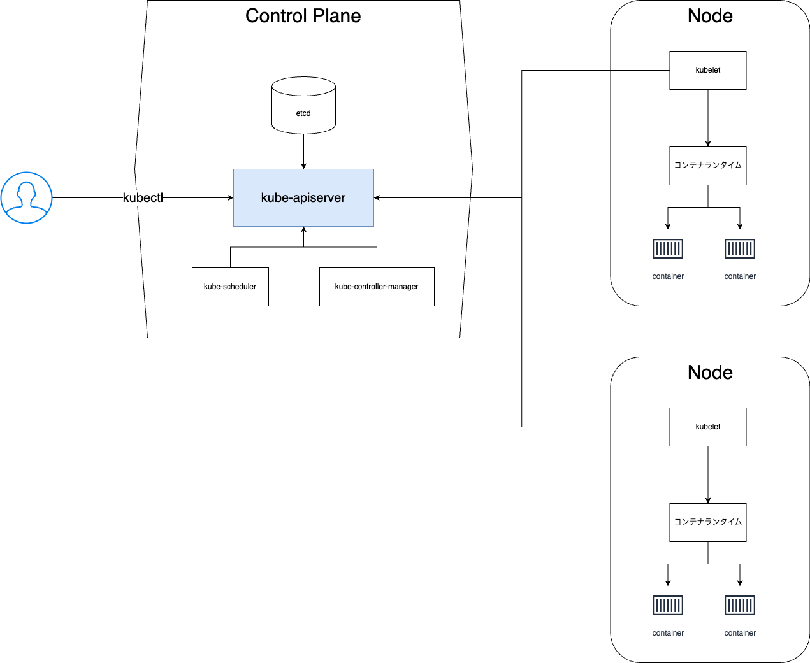

## Kubernetesアーキテクチャ
- 
- Control Plane
  - etcd
    - データストアとして利用される
  - kube-apiserver
    - kubernetesのAPIサーバー
    - kubectlで渡されるコマンドはすべてkube-apiserverからAPIリクエストとして処理される
    - kube-apiserverはRESTful
  - kube-scheduler
    - Podを適切なNodeに割り当てるスケジューラ
  - kube-controller-manager
    - コントローラー自身の管理モジュール
- Node
  - kubelet
    - 各Nodeに存在するマスター的なエージェントモジュール
    - Node内でコンテナが正しく動作しているかの管理を行う
  - コンテナランタイム
    - コンテナを実行および管理するためのソフトウェア。主な役割はコンテナイメージをダウンロードし、コンテナを起動・停止・削除することです。
    - 例
      - Docker
      - containerd
      - CRI-O
      - runc